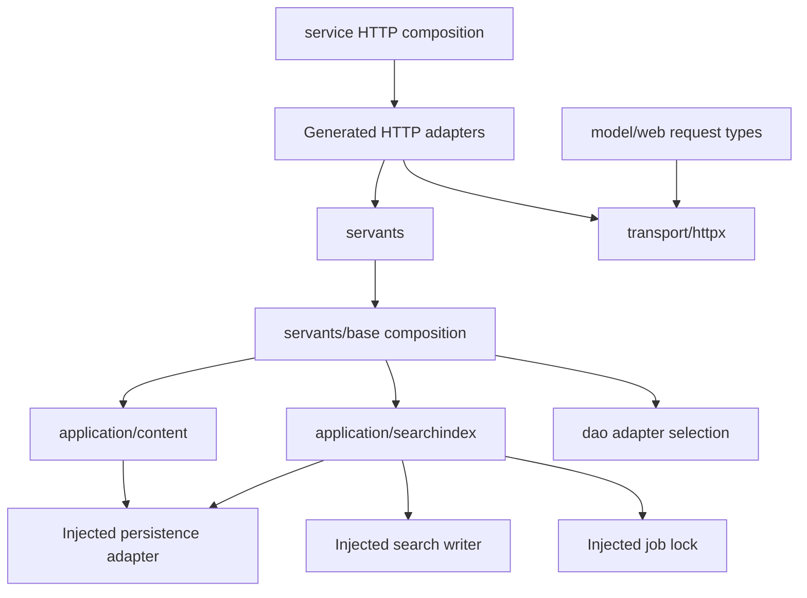

# Backend module structure

The backend keeps its existing Go, Gin, generated HTTP adapters, GORM persistence,
feature suite, and database schema. This refactor concentrates shared behavior
behind modules that can be exercised without bootstrapping backing services.
It does not implement feature tickets or change endpoint names and JSON shapes.



## Module responsibilities

| Module | Interface and responsibility | Verification surface |
| --- | --- | --- |
| `internal/service` | Shared HTTP engine policy and address-based server composition. The first registration at an address owns the engine and timeout policy; later registrations reuse it. | Route requests, routing errors, cross-origin headers, and shared-address routing. |
| `internal/transport/httpx` | Binding, authenticated request context, pagination hydration, and response rendering. `New(sentryEnabled)` selects the existing binding behavior. It does not initialize persistence. | Binding and rendering through `Servant`, with and without Sentry. |
| `internal/application/content` | Content assembly, viewer enrichment, and the shared post read policy. `New(store)` accepts only the persistence operations this module needs. | `Views` methods with an in-memory adapter, including both post representations, roles, following, guests, and failures. |
| `internal/application/searchindex` | `Put`, `Sync`, and `Delete` hide text projection and full-sync paging and locking. `New(store, writer, lock)` accepts the three internal seams. | Single and full indexing, paging, repeated runs, errors, and cancellation with in-memory adapters. |
| `internal/servants/base` | Composes these capabilities using the existing production adapters, and schedules search work through the existing event manager. | Compilation of existing handlers and the constraint build tag. |
| `internal/model/joint` | Owns the shared JSON pagination envelope. Request and response types no longer import application composition to describe pagination. | Existing response conversion and HTTP envelope tests. |

## Interface contracts

`Views` retains existing in-place enrichment and the distinction between a guest
ID (`-1`) and a logged-in viewer. Raw post visibility is used for authorization;
formatted visibility conversion keeps its existing behavior. No role, moderation,
or following rule is changed by extracting the module.

`searchindex.Sync` uses pages of 1,000 posts and the total returned by the first
page, as before. This is a page-count snapshot, not a transactional database
snapshot: concurrent modifications can still change which rows are returned.
The production writer queues writes, so success means writer acceptance rather
than a guarantee that a remote index is already updated.

An acquired full-sync lock is released on success, failure, or cancellation.
Unlike the former loop, projection failures terminate the job instead of retrying
the same page indefinitely. Store and writer failures are returned to the event
manager; single-post events also return write failures. There is no automatic
retry or rollback of documents already accepted by the writer. Cancellation is
observed between pages; cancellation cannot interrupt a persistence or writer
operation whose existing interface has no context parameter.

`httpx.Servant.BindJson` deliberately retains the existing generic `ShouldBind`
behavior, including form binding. Sentry error-detail behavior and successful
request hydration retain their existing contracts. Pagination still reads the
existing bootstrap config through `pkg/app`; the module does not require a
configuration file merely to be imported.

## Extending the structure

Keep shared business behavior in an application module and inject its actual
backing adapters at composition. HTTP handlers should map requests to that
module's interface and render results. Introduce a seam where production and
verification actually need different adapters, rather than wrapping every
function in a new interface.

The existing `core/ms` types still alias GORM record types, and most feature
handlers still use the aggregate `core.DataService`. The application modules
introduced here narrow their own dependencies without pretending that the
entire backend is persistence-independent. These are existing constraints, not
a newly introduced compatibility layer or a second framework.

## Checks

From a clean checkout, prepare `web/dist` for the existing embed directive and
run the default checks, optional-feature build, and race checks:

```sh
mkdir -p web/dist
go build ./...
go test ./...
go build -tags 'migration,embed,constraint' ./...
go test -race ./internal/application/... ./internal/transport/... ./internal/service
```

The repository pins golangci-lint to v1.64.8. Use the Go 1.24 toolchain from
`go.mod` when running it; its analyzer cannot read the newer export format used
by the local Go 1.27.1 toolchain. This does not require changing application dependencies or CI config.
